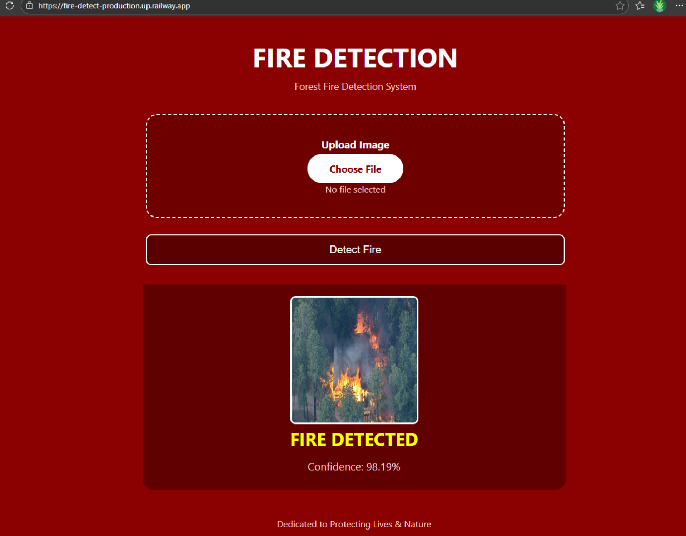

#  Fire Detection System

##  About

A fire detection system that uses deep learning to detect fires from images. Built to help protect forests.

##  Features

- Fire and smoke detection from images
- 97% accuracy
- Web-based interface
- Easy to use

##  Tech Stack

- Python
- TensorFlow / Keras
- Flask
- HTML / CSS

##  Project Structure
```
Fire-Detection/
├── data/
│   ├── raw/              
│   └── processed/        
├── models/
│   └── fire_model.h5     
├── src/
│   ├── explore_data.py
│   ├── process_data.py
│   ├── split_data.py
│   ├── train_model.py
│   └── predict.py
├── templates/
│   └── index.html
├── static/
│   └── uploads/         
├── app.py
├── requirements.txt
├── .gitignore
└── README.md
```

##  Installation

1. Clone the repository
```bash
git clone https://github.com/afsanarhea/Fire-Detection.git
cd Fire-Detection
```

2. Install dependencies
```bash
pip install -r requirements.txt
```

3. Run the app
```bash
python app.py
```

4. Open browser: `http://127.0.0.1:5000`

##  Model Performance

| Metric | Score |
|--------|-------|
| Training Accuracy | 98.25% |
| Testing Accuracy | 97.00% |

##  Live Demo

(https://huggingface.co/spaces/Afsana01/fire-detection)

##  Demo



##  License

MIT License
